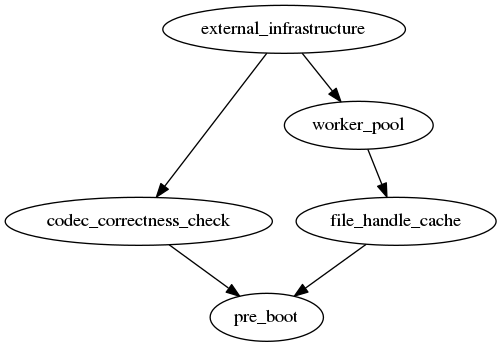

# RabbitMQ的启动方式
RabbitMQ在启动的过程中使用了有向图的方式，最主要使用了Erlang的digraph库。
digraph是Erlang用来处理有向图的一个库。
# 启动流程图

# 为什么这么作
RabbitMQ使用有向图进行依赖启动，是有以下几个考虑。
* 方便维护，项目变得庞大的时候，如果将需要启动的进程都写在几个supervisor中是非常不好维护的
* 方便插件加入，RabbitMQ支持大量的插件，插件启动的时候，需要依赖RabbitMQ内部很多组件的初始化，
使用这种方式，就能很好的保证启动顺序
* 非Erlang进程的初始化过程，因为在部分进程初始化的过程中，插入了一些只需要执行函数就能完成的初始化过程
如果放在supervisor中会有些不方便。

# 是如何完成的
RabbitMQ使用Erlang中module_info函数来获得模块的所有attributes，并通过遍历的方式
过滤所关心的attribute。
这些特殊的attribute就是我们所熟知的rabbit_boot_step。通过rabbit_boot_step，我们
可以定义启动过程的MFA和前置步骤和准许的步骤。
RabbitMQ为了方便定义，定义了几个核心步骤，我们可以从上面的图中看的一清二楚。
当我们有了这些启动步骤后，RabbitMQ使用digraph这个函数库构建了有向图，并使用广度
优先算法，生成了所有的启动顺序，这样RabbitMQ就完成了启动流程的构建，完成了真正启
动的准备。
